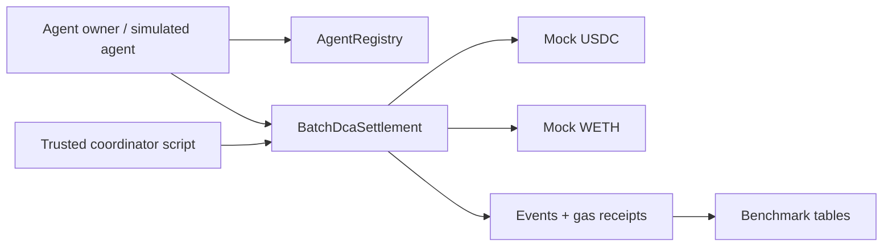

# Architecture

This project implements Shape A from the project notes: **Intent Batcher for Scheduled Agents**.

The core claim is simple: if many autonomous agents want to execute small scheduled actions, the system can reduce execution overhead by storing intent metadata once and letting a coordinator execute many due intents in one settlement transaction.

## System Overview



The deployed MVP has four moving parts:

- `AgentRegistry`: maps `agentId` to owner, strategy ID, active flag, and creation time.
- `MockToken`: minimal mintable ERC-20-like token used for reproducible testnet runs.
- `BatchDcaSettlement`: stores recurring DCA intents and executes them.
- TypeScript scripts: deploy, seed, coordinate, and benchmark the protocol.

The project uses Foundry for Solidity compilation, tests, gas reporting, and deployment. TypeScript uses `ethers` only for off-chain orchestration.

## Contract Responsibilities

### AgentRegistry

`AgentRegistry` is intentionally small. It answers two questions:

- Who owns this agent?
- Is this agent currently active?

Only the owner can deactivate or reactivate an agent. `BatchDcaSettlement` reads the registry during intent creation and execution.

### MockToken

`MockToken` exists to avoid relying on Sepolia DEX liquidity. It implements the ERC-20 functions the prototype needs:

- `mint`
- `approve`
- `transfer`
- `transferFrom`
- `balanceOf`
- `allowance`

These tokens are test artifacts and have no market value.

### BatchDcaSettlement

`BatchDcaSettlement` is the protocol layer. It stores `RecurringIntent` records:

- `agentId`
- `amountIn`
- `minAmountOut`
- `intervalSeconds`
- `nextExecution`
- `deadlineWindow`
- `maxExecutions`
- `executions`
- `active`

Agent owners create, update, and cancel their own recurring intents. The trusted coordinator executes due intents.

Execution checks:

- Intent is active.
- Agent is active.
- Current time is at or after `nextExecution`.
- Current time has not passed `nextExecution + deadlineWindow`.
- `maxExecutions` has not been reached.
- Input amount is nonzero.
- Quoted output is at least `minAmountOut`.
- Owner has approved enough input token.
- Settlement contract has enough output token liquidity.

After execution, the contract increments `executions`. If the intent is complete, it deactivates it. Otherwise it advances `nextExecution`.

## Coordinator Model

The coordinator is trusted in this MVP. It does not custody user assets, but it decides which due intents to include in a batch.

Current coordinator flow:

1. Load `deployments/<network>.json`.
2. Load `deployments/<network>-intents.json`.
3. Query `isDue(intentId)` for known intent IDs.
4. Submit `executeBatch(uint256[] intentIds)`.
5. Save gas metrics under `metrics/`.

The deployer is the coordinator by default. The coordinator can be changed on-chain with `setCoordinator`.

## Scalability Mechanism

The naive baseline executes one transaction per intent:

```text
executeIntent(1)
executeIntent(2)
executeIntent(3)
...
```

The batched path executes many intents in one transaction:

```text
executeBatch([1, 2, 3, ...])
```

Batching reduces repeated transaction overhead and amortizes shared coordinator cost. The expected result is lower gas per intent, not lower absolute gas than a single intent.

## Current Sepolia Evidence

Deployment:

```text
AgentRegistry:      0x2ca0b63FA3d2574D916F57Be1264741a14D29192
MockUSDC:           0x2A1499f86c5E1c73d5e6627daefd565006C5d70E
MockWETH:           0x366D4c45d29d443474628F48faaD15FD151689d7
BatchDcaSettlement: 0xa587ABBB1C59A20fd10B766c8FCc3768Bbf0D5D2
```

Benchmark for 3 intents:

```text
Naive total gas: 262,686
Naive gas / intent: 87,562
Batch total gas: 150,773
Batch gas / intent: 50,257
Gas reduction: 42.6%
```

## Non-Goals

The MVP deliberately does not implement:

- ERC-4337 account abstraction.
- Real LLM agents.
- Real DEX routing.
- Cross-chain settlement.
- Permissionless solver auctions.
- Private intent submission.

These are good report discussion points, but they are not required for the current prototype.

